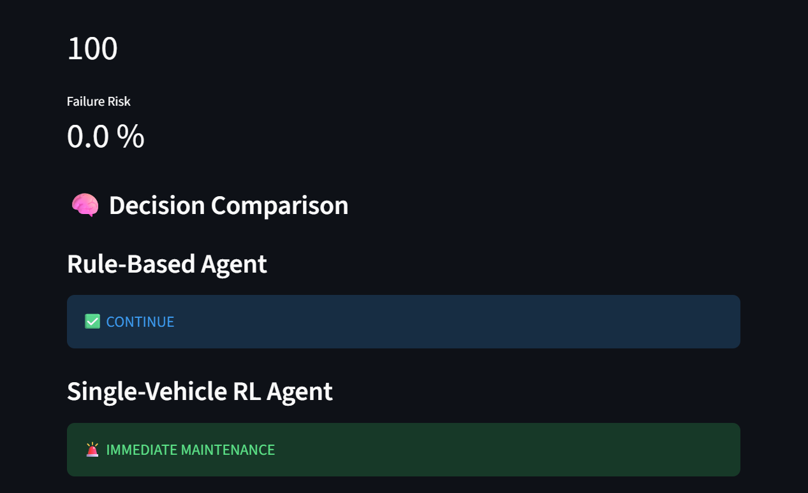
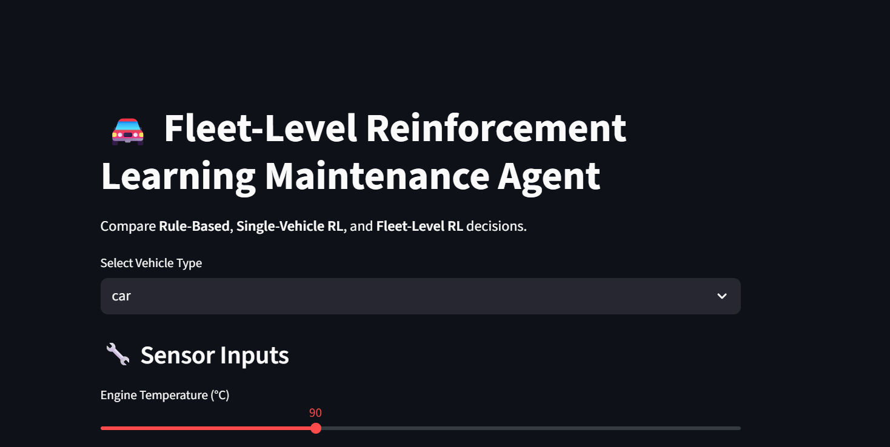
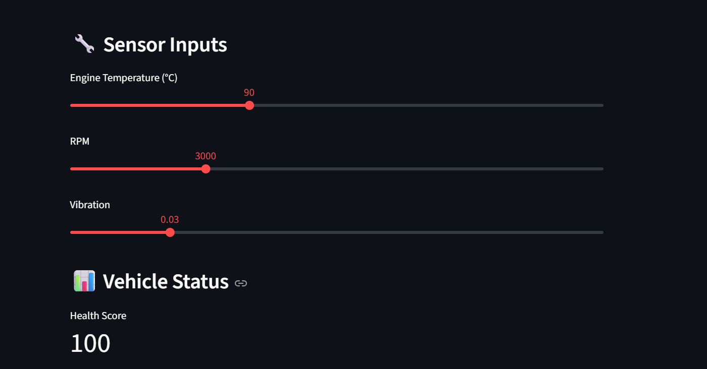

# Vehicle Health & Failure Prevention Agent

Phase 1 completed:
- Loaded vehicle sensor data
- Calculated vehicle health score using rule-based logic
- Built foundation for predictive maintenance agent

Phase 2 completed:
- Added failure labels
- Trained machine learning model
- Predicted vehicle failure probability

Phase 3 completed:
- Integrated health scoring + ML failure prediction
- Built autonomous decision-making maintenance agent
- Implemented observe–decide–act loop

Phase 4 completed:
- Implemented continuous agent loop
- Added decision memory for learning
- Simulated real-time vehicle monitoring

Phase 5 completed:
- Built multi-vehicle intelligent maintenance agent
- Added cost-aware decision logic
- Supported car, truck, and aircraft engines

Phase 5 (Extended):
- Added bike and scooter support
- Implemented vehicle-specific sensor simulation
- Unified intelligent agent across 2-wheelers, cars, trucks, and aircraft

Phase 6 completed:
- Built interactive Streamlit dashboard for the agent
- Visualized vehicle health score and failure probability in real time
- Compared agent decisions using live sensor inputs
- Enabled what-if analysis through sliders and vehicle selection

Phase 7 completed:
- Designed and implemented a Reinforcement Learning (RL) based maintenance agent
- Created a custom Gymnasium environment for vehicle maintenance decisions
- Trained a PPO-based RL agent to learn optimal actions via reward feedback
- Replaced fixed decision rules with a learning-based policy

Phase 7 (Extended – Fleet-Level Intelligence):
- Designed a centralized fleet-level RL environment controlling multiple vehicles
- Implemented a fleet-level reward function balancing:
  - Failure avoidance
  - Maintenance cost
  - Fleet downtime congestion
- Trained a fleet-level PPO agent to optimize global fleet performance
- Demonstrated differences between single-vehicle RL and fleet-level RL behavior

Phase 7 (Dashboard Integration):
- Integrated single-vehicle RL agent into the Streamlit dashboard
- Integrated fleet-level RL agent into the dashboard
- Displayed side-by-side comparison of:
  - Rule-based decisions
  - Single-vehicle RL decisions
  - Fleet-level RL decisions
- Demonstrated how global optimization differs from local decision-making

Phase 8 completed (Production Hardening):
- Added structured logging for all agent decisions (system.log)
- Implemented monitoring of agent decision distribution
- Added alerting for high-risk and safety-critical scenarios
- Introduced safety guardrails and override mechanisms
- Improved system observability and auditability

Final Outcome:
- Built an end-to-end agentic AI system for vehicle predictive maintenance
- Supported heterogeneous vehicles (car, truck, aircraft, bike, scooter)
- Implemented rule-based, learning-based, and fleet-optimized agents
- Delivered a real-time, production-style dashboard
- Applied MLOps principles for logging, monitoring, and safety

---

## 🖼️ Diagrams & Screenshots
 
 
 

### 📐 System Architecture

